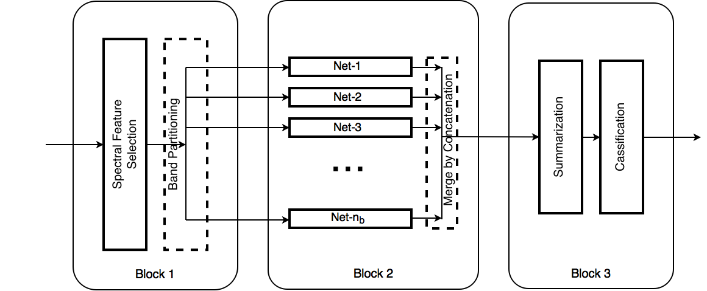

# BASS Net
### Band-Adaptive Spectral-Spatial Feature Learning Neural Network for Hyperspectral Image Classification

##### Summary:
Deep learning based landcover classification algorithms have recently been proposed in literature. In hyperspectral images (HSI) they face the challenges of large dimensionality, spatial variability of spectral signatures and scarcity of labeled data. In this work we propose an end-to-end deep learning architecture that extracts band specific spectral-spatial features and performs landcover classification. The architecture has fewer independent connection weights and thus requires lesser number of training data. The method is found to outperform the highest reported accuracies on popular hyperspectral image data sets.

Please refer to our [paper](https://arxiv.org/abs/1612.00144) for details.



##### Description of the repository:
This repository contains code to build and test the Configuration 4 architecture in the paper. The code has the option to work on one of the three popular [Hyperspectral Image Classification datasets](http://www.ehu.eus/ccwintco/index.php?title=Hyperspectral_Remote_Sensing_Scenes) viz. Indian Pines, Salinas and Pavia University Scene. 

* Dependencies:
	1. Lua 5.2
	2. Python 2.7
	3. Torch 7
	4. Matio

 	
* Execution instructions:

	1. Run ```preprocessing.py``` for preparing the dataset. 
	
		e.g.
	
		```
		python preprocessing.py --data Indian_pines --patch_size 3
		```
		
	2. Run ```bass-net_model.lua``` for building the model, training and testing.

		e.g.
		
		```
		th bass-net_model.lua --path_dir "./data/" --data Indian_pines --development 1 --optimization "Adam" --learningRate 0.0005 --maxIter 8000 --nbands 10 --patch_size 3 
		```
	
